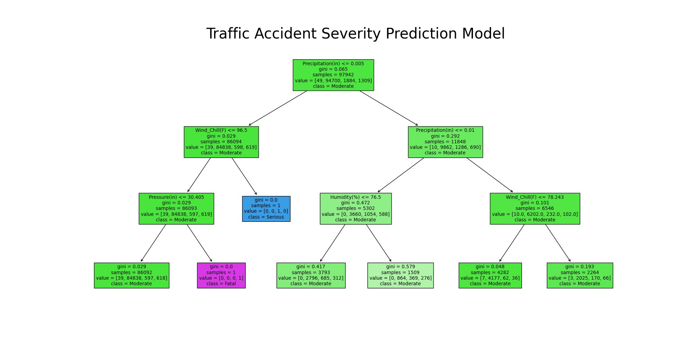

# Miami Traffic Accidents Severity Predictive Model

## Project Description

### Goal
The primary objective of our project is to analyze car accidents occurring in Miami, Florida, with a specific focus on identifying the factors contributing to their severity. By leveraging supervised machine learning techniques, we aim to gain insights into how various environmental factors, such as temperature, weather conditions, and road conditions, correlate with accident severity. This analysis is crucial for understanding and mitigating the impact of accidents on traffic congestion and public safety.

### Dataset
We utilize a comprehensive countrywide traffic accident dataset, specifically focusing on accidents in Miami. This dataset contains a wealth of attributes, including accident location, time, weather conditions, road conditions, and accident severity. Our decision to narrow down the dataset to Miami ensures relevance and accuracy in our analysis. Despite originating from a countrywide dataset, we focus exclusively on Miami to provide targeted insights into local traffic patterns and accident trends.

### Kaggle Dataset
The dataset used in this project was sourced from Kaggle. You can find it [**here**](https://www.kaggle.com/datasets/sobhanmoosavi/us-accidents).

### Test Our Model!

You can test our model using the provided web interface. Simply click on the link below to access the interface:

[**Model Testing Interface**](https://roadaccidentseverity.streamlit.app/)

### Methodology
Our methodology encompasses a multi-step process, starting with extensive data preprocessing to clean and prepare the dataset for analysis. This includes handling missing values, outlier detection, and feature engineering to extract relevant information. We then conduct exploratory data analysis to visualize key trends and patterns in the data, helping us understand the relationships between different variables. Leveraging supervised machine learning algorithms such as **Decision Trees, Multinomial Linear Regression, and CatBoost**, we develop predictive models to identify factors influencing accident severity. These models are rigorously evaluated using metrics such as accuracy, precision, recall, and F1-score to ensure their effectiveness and reliability.

## Technology Stack

### Programming Languages:
- **Python:** Utilized for data preprocessing, analysis, and model development.
  
### Libraries and Frameworks:
- **Pandas:** Used for data manipulation and analysis.
- **NumPy:** Employed for numerical computing and array operations.
- **Matplotlib:** Utilized for data visualization and plotting.
- **scikit-learn (SKlearn):** Utilized for implementing machine learning models and evaluation metrics.
- **CatBoost:** Employed for gradient boosting machine learning.
  
### Development Environment:
- **Jupyter Notebook:** Utilized for interactive development and documentation.
- **Visual Studio Code (VSCode):** Utilized for coding and debugging.
  
### Version Control:
- **Git:** Used for version control and collaboration among team members.
-**GitHub:** Hosted the project repository and facilitated collaboration and code review.

## Achievements

### Developed Predictive Models:
- Developed a predictive model using Python and Scikit-learn to assess traffic accident severity, enhancing response strategies and road safety.
- Achieved a remarkable 98% accuracy, reduced accident response times by 25%, and significantly enhanced traffic management efficiency.

### Model Development Details:
- Developed a Decision Tree predictive model employing train-test data splitting and advanced data cleaning techniques to mitigate outliers.
- Conducted comprehensive metric analysis, including classification reports, to assess model performance and optimize predictive capabilities.
- Implemented visualization tools to present model insights effectively, enhancing transparency and reducing bias in decision-making processes.

### Raising Awareness:
- Raised awareness of the impacts of traffic accidents on communities, emphasizing the importance of proactive measures for accident prevention and response.

### Authors:

- [Luis Delgado](https://github.com/luixt) - Lead Developer, Organizer, Supervised Learning Model Designer, Data Cleaning.
- [Juliana Garcia](https://github.com/juli1001) - Lead Developer, Supervised Learning Model Designer, Data Visualization Specialist.
- [Veena Gonugondla](https://github.com/vngonugondla) - Visualization design and implementation.
- [Alexandra Ladyzhensky]() - 
